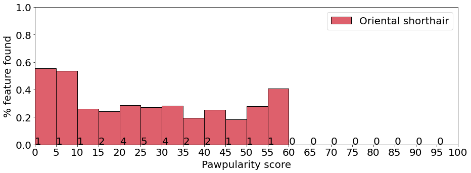

# TxMM-PawpularityContest

This repository contains the following files:

- Part I: TxMM_TabularFeatures.ipynb
- Part II: TxMM_VisionAPI.ipynb
- Part III: TxMM_Analysis.ipynb
- The created dataset: pawpularityVision.csv

As illustration of this research, we analysed a dataset of 9912 cat and dog images taken from [PetFinder.my's Kaggle competition](https://www.kaggle.com/c/petfinder-pawpularity-score). Each photo had a popularity score derived by user-clicks on their online adoption platform. We use this score to determine which features make cats and dogs more popular or less popular. In the plots below, one can see that dogs were in general more popular, because they relatively had higher scores than cats.

After splitting the data in separate cats and dogs data, we investigated which breeds were more popular than others. The plots below show the most popular and less popular cat and dog breed (which were recognized by the Google Cloud Vision API). The height of the bars are the normalised sums (how often the breed was found in the bin divided by the number of photos in the bin). This normalisation makes comparing different bins and breeds possible. At the bottom of the bars, the absolute number of labels found is shown. Recall the imbalanced distribution, so these numbers are not comparable, but give an indication of size. See the notebooks for more information such as the correlation coefficients. 

